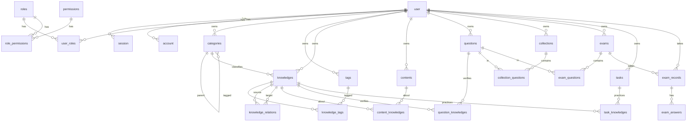

# 实体设计

对应 `apps/api` 领域模块。表名 `snake_case`，TypeScript 实体 PascalCase。主键一律 UUID。时间字段 `timestamptz`。用户自有数据带 `owner_id`；角色与权限是全局配置。

## 约定

| 项     | 规则                                                                                                              |
| ------ | ----------------------------------------------------------------------------------------------------------------- |
| 主键   | `id uuid`，应用侧生成                                                                                             |
| 审计   | `created_at`、`updated_at`；关联表同样保留 `updated_at`（软删除会改这一列）                                       |
| 删除   | 软删除：`deleted_at timestamptz`，空表示未删。默认查询过滤 `deleted_at IS NULL`。唯一约束做成部分索引（仅未删行） |
| 状态   | 启用/禁用用 `boolean`（角色、权限、业务实体）。用户停用走 Better Auth `banned`，不用 `status` 表示删除            |
| 进度   | 工作流用独立字段 `progress`（考试作答、任务），不占用 `status`                                                    |
| 归属   | 业务行用 `owner_id → user.id`（Better Auth 的 `user` 表）；管理员可跨用户                                         |
| 权限码 | `resource:action`，如 `knowledge:create`                                                                          |
| JSON   | PostgreSQL `jsonb`，用于选项、答案、附件元数据                                                                    |

---

## 关系总览

---

## 1. Auth / RBAC

认证交给 **Better Auth**（`user` / `session` / `account` / `verification` / `jwks`）。角色权限是我们自己的表，不塞进 Better Auth。

会话（Cookie 或 `set-auth-token` Bearer）有效期 **7 天**，用来换 access JWT。access JWT 有效期 **10 小时**（`GET /api/auth/token`）。业务接口优先认 JWT，否则走 session。

软删除一律用 `deleted_at`，不用 `status`。角色、权限上的 `status` 只表示启用/禁用。

### roles

| 字段       | 类型         | 约束                   | 说明                                  |
| ---------- | ------------ | ---------------------- | ------------------------------------- |
| id         | uuid         | PK                     |                                       |
| code       | varchar(50)  | not null               | `admin` / `user`                      |
| name       | varchar(100) | not null               |                                       |
| status     | boolean      | not null, default true | `true` 启用，`false` 禁用（不是删除） |
| created_at | timestamptz  | not null               |                                       |
| updated_at | timestamptz  | not null               |                                       |
| deleted_at | timestamptz  | nullable               | 非空即软删除                          |

部分唯一索引：`(code) WHERE deleted_at IS NULL`。

鉴权只加载 `deleted_at IS NULL AND status = true` 的角色。内置 `admin`、`user` 不允许软删除。

### permissions

| 字段       | 类型         | 约束                   | 说明                                  |
| ---------- | ------------ | ---------------------- | ------------------------------------- |
| id         | uuid         | PK                     |                                       |
| code       | varchar(100) | not null               | `knowledge:create`                    |
| name       | varchar(100) | not null               |                                       |
| status     | boolean      | not null, default true | `true` 启用，`false` 禁用（不是删除） |
| created_at | timestamptz  | not null               |                                       |
| updated_at | timestamptz  | not null               |                                       |
| deleted_at | timestamptz  | nullable               | 非空即软删除                          |

部分唯一索引：`(code) WHERE deleted_at IS NULL`。

初始权限：`knowledge`、`content`、`question`、`exam`、`task` 各自 `read/create/update/delete`。内置权限不允许软删除。`user.role === 'admin'`（Better Auth 角色字段）时 `PermissionGuard` 跳过权限码校验。

### user_roles

中间表自带主键，解绑走 `deleted_at`，便于再绑定。

| 字段       | 类型        | 约束               | 说明                  |
| ---------- | ----------- | ------------------ | --------------------- |
| id         | uuid        | PK                 |                       |
| user_id    | uuid        | FK user, not null  | Better Auth `user.id` |
| role_id    | uuid        | FK roles, not null |                       |
| created_at | timestamptz | not null           |                       |
| updated_at | timestamptz | not null           |                       |
| deleted_at | timestamptz | nullable           | 非空即已解绑          |

部分唯一索引：`(user_id, role_id) WHERE deleted_at IS NULL`。

新注册用户默认绑定角色 `user`。

### role_permissions

| 字段          | 类型        | 约束                     | 说明               |
| ------------- | ----------- | ------------------------ | ------------------ |
| id            | uuid        | PK                       |                    |
| role_id       | uuid        | FK roles, not null       |                    |
| permission_id | uuid        | FK permissions, not null |                    |
| created_at    | timestamptz | not null                 |                    |
| updated_at    | timestamptz | not null                 |                    |
| deleted_at    | timestamptz | nullable                 | 非空即已收回该权限 |

部分唯一索引：`(role_id, permission_id) WHERE deleted_at IS NULL`。

### user

Better Auth 核心表，不另建用户表。id 配置为 uuid，与全局约定一致。

库内置列不改语义。我们只追加软删除，以及 Admin 插件的停用字段。

| 字段           | 类型        | 来源             | 说明                                           |
| -------------- | ----------- | ---------------- | ---------------------------------------------- |
| id             | uuid        | Better Auth      | PK                                             |
| name           | varchar     | Better Auth      | 显示名                                         |
| email          | varchar     | Better Auth      | 登录名                                         |
| email_verified | boolean     | Better Auth      | 邮箱是否已验证，不再单独建 `email_verified_at` |
| image          | varchar     | Better Auth      | 头像，可空                                     |
| created_at     | timestamptz | Better Auth      |                                                |
| updated_at     | timestamptz | Better Auth      |                                                |
| deleted_at     | timestamptz | additionalFields | 软删除；空表示未删                             |
| banned         | boolean     | admin 插件       | 停用账号，仍占邮箱                             |
| ban_reason     | text        | admin 插件       | 可空                                           |
| ban_expires    | timestamptz | admin 插件       | 可空；空表示永久停用                           |
| role           | text        | admin 插件       | Better Auth 内置角色字段，与自建 RBAC 分开     |

部分唯一索引：`(email) WHERE deleted_at IS NULL`（Better Auth 默认 email unique 要改成这条，否则注销后无法再用同一邮箱注册）。

登录：`deleted_at IS NULL` 且未 `banned`（或 `ban_expires` 已过）。软删除不改业务表的 `owner_id`。

Better Auth 的 `session`、`account`、`verification`、`jwks` 由库维护，不做软删除：注销用户时撤 session；解绑走库的 account 删除，不自建 `oauth_accounts`。

### session / account / verification / jwks

| 表           | 职责                                                  |
| ------------ | ----------------------------------------------------- |
| session      | 登录会话（7 天）；用户软删除时由 Better Auth 撤销     |
| account      | 密码哈希与 OAuth 绑定（`provider_id` + `account_id`） |
| verification | 邮箱验证、重置密码等一次性凭证                        |
| jwks         | JWT 插件密钥；签发 10 小时 access token               |

---

## 2. Knowledge

软删除一律用 `deleted_at`（与 auth `user` 相同），**不用 `status`**。草稿/发布用 `published`，不再用 `DRAFT` / `ACTIVE` / `ARCHIVED` 枚举。

### categories

树形分类，`parent_id` 自关联，不拆 SubCategory。

| 字段        | 类型         | 约束                    | 说明                             |
| ----------- | ------------ | ----------------------- | -------------------------------- |
| id          | uuid         | PK                      |                                  |
| owner_id    | uuid         | FK user, not null       |                                  |
| parent_id   | uuid         | FK categories, nullable | 根节点为空；不可指向已软删除节点 |
| name        | varchar(100) | not null                |                                  |
| slug        | varchar(120) | not null                |                                  |
| description | text         | nullable                |                                  |
| sort        | int          | not null, default 0     | 同级排序，越小越前               |
| created_at  | timestamptz  | not null                |                                  |
| updated_at  | timestamptz  | not null                |                                  |
| deleted_at  | timestamptz  | nullable                |                                  |

部分唯一索引：`(owner_id, parent_id, slug) WHERE deleted_at IS NULL`。`parent_id` 为空时用 `COALESCE(parent_id, '00000000-0000-0000-0000-000000000000')` 或等价部分索引覆盖根节点。

应用层：禁止把节点设为自己的子孙；存在未删除子节点时禁止软删除；软删除后 `knowledges.category_id` 不改，展示时分类已删则视为未分类。

### tags

横向特征，如 Hook、性能、设计模式。

| 字段       | 类型        | 约束              | 说明 |
| ---------- | ----------- | ----------------- | ---- |
| id         | uuid        | PK                |      |
| owner_id   | uuid        | FK user, not null |      |
| name       | varchar(50) | not null          |      |
| created_at | timestamptz | not null          |      |
| updated_at | timestamptz | not null          |      |
| deleted_at | timestamptz | nullable          |      |

部分唯一索引：`(owner_id, name) WHERE deleted_at IS NULL`。

### knowledges

知识点本身。正文可空：允许先建节点，再靠 Content 承载材料。

| 字段        | 类型         | 约束                    | 说明                               |
| ----------- | ------------ | ----------------------- | ---------------------------------- |
| id          | uuid         | PK                      |                                    |
| owner_id    | uuid         | FK user, not null       |                                    |
| category_id | uuid         | FK categories, nullable | 可指向已软删除分类，展示时当未分类 |
| title       | varchar(200) | not null                |                                    |
| summary     | text         | nullable                |                                    |
| body        | text         | nullable                | 可选的要点正文                     |
| published   | boolean      | not null, default false | `false` 草稿，`true` 已发布        |
| created_at  | timestamptz  | not null                |                                    |
| updated_at  | timestamptz  | not null                |                                    |
| deleted_at  | timestamptz  | nullable                |                                    |

工作台列表：`deleted_at IS NULL`（包含草稿）。公开浏览（本期不做）才过滤 `published = true`。

索引：`(owner_id, category_id)`、`(owner_id, published)`（均配合查询侧过滤 `deleted_at`）。

### knowledge_tags

中间表自带主键，摘标签为软删除。

| 字段         | 类型        | 约束                    | 说明 |
| ------------ | ----------- | ----------------------- | ---- |
| id           | uuid        | PK                      |      |
| knowledge_id | uuid        | FK knowledges, not null |      |
| tag_id       | uuid        | FK tags, not null       |      |
| created_at   | timestamptz | not null                |      |
| updated_at   | timestamptz | not null                |      |
| deleted_at   | timestamptz | nullable                |      |

部分唯一索引：`(knowledge_id, tag_id) WHERE deleted_at IS NULL`。

### knowledge_relations

有向关系。同一对节点同一类型在未删除行中只允许一条。

| 字段          | 类型        | 约束                    | 说明                 |
| ------------- | ----------- | ----------------------- | -------------------- |
| id            | uuid        | PK                      |                      |
| owner_id      | uuid        | FK user, not null       | 冗余，便于按用户查询 |
| source_id     | uuid        | FK knowledges, not null |                      |
| target_id     | uuid        | FK knowledges, not null |                      |
| relation_type | varchar(30) | not null                | 见下表               |
| created_at    | timestamptz | not null                |                      |
| updated_at    | timestamptz | not null                |                      |
| deleted_at    | timestamptz | nullable                |                      |

部分唯一索引：`(source_id, target_id, relation_type) WHERE deleted_at IS NULL`。检查：`source_id <> target_id`。两端知识点已软删除时，关系仍保留行，默认查询不可见。

| relation_type | 含义                   |
| ------------- | ---------------------- |
| RELATED       | 相关                   |
| PREREQUISITE  | source 的前置是 target |
| DERIVED       | source 由 target 派生  |
| EXTENDS       | source 扩展 target     |
| CONTRASTS     | 对比                   |

---

## 3. Content

本节已按软删除对齐。不要 `status`。`type` 是载体形态，不是启用状态。工作台列表含草稿。

### contents

知识载体。一张表 + `type` 区分形态，避免 Note / Article / Document / Resource 四套平行结构。本期 **不接对象存储**：`file_key` 由客户端传入字符串。

| 字段       | 类型          | 约束                    | 说明                                            |
| ---------- | ------------- | ----------------------- | ----------------------------------------------- |
| id         | uuid          | PK                      |                                                 |
| owner_id   | uuid          | FK user, not null       |                                                 |
| type       | varchar(20)   | not null                | `NOTE` / `ARTICLE` / `DOCUMENT` / `RESOURCE`    |
| title      | varchar(200)  | not null                |                                                 |
| body       | text          | nullable                | NOTE / ARTICLE 正文                             |
| summary    | text          | nullable                | 主要用于 ARTICLE                                |
| url        | varchar(2000) | nullable                | RESOURCE 外链                                   |
| file_key   | varchar(500)  | nullable                | DOCUMENT 对象 key（字符串，不校验对象是否存在） |
| mime_type  | varchar(100)  | nullable                | DOCUMENT                                        |
| file_size  | bigint        | nullable                | 字节                                            |
| metadata   | jsonb         | nullable                | 额外信息                                        |
| published  | boolean       | not null, default false | `false` 草稿，`true` 已发布                     |
| created_at | timestamptz   | not null                |                                                 |
| updated_at | timestamptz   | not null                |                                                 |
| deleted_at | timestamptz   | nullable                |                                                 |

默认列表：`owner_id = 当前用户 AND deleted_at IS NULL`（含草稿）。可用 `published`、`type`、`knowledgeId`、`q`（title `ilike`）过滤。

索引：`owner_id`；`(owner_id, published)`；`(owner_id, type)`。

按 type 约束（应用层）：

- `NOTE`：`body` 必填；`url` / `file_key` 写成 null
- `ARTICLE`：`body` 必填；`url` / `file_key` 写成 null；`summary` 可选
- `DOCUMENT`：`file_key` 必填；`body` / `url` 写成 null；`mime_type` / `file_size` 可选
- `RESOURCE`：`url` 必填；`body` / `file_key` 写成 null

更改 `type` 的同一次请求必须带上该形态合法字段，否则 400。

软删除 DOCUMENT 不删外部文件（本期无对象存储）。

### content_knowledges

一条内容可挂多个知识点。解绑为软删除。`knowledgeIds` 出现则整表替换。

| 字段         | 类型        | 约束                    | 说明 |
| ------------ | ----------- | ----------------------- | ---- |
| id           | uuid        | PK                      |      |
| content_id   | uuid        | FK contents, not null   |      |
| knowledge_id | uuid        | FK knowledges, not null |      |
| created_at   | timestamptz | not null                |      |
| updated_at   | timestamptz | not null                |      |
| deleted_at   | timestamptz | nullable                |      |

部分唯一索引：`(content_id, knowledge_id) WHERE deleted_at IS NULL`。

挂接：内容必须已发布；每个 `knowledgeId` 同一 owner、未删、已发布。空数组清空。草稿带非空 `knowledgeIds` → 400。跨 owner / 已软删知识 → 404。未发布知识 → 400。

软删内容时，将其未删的 `content_knowledges` 一并软删。越权、跨 owner、已软删内容 → **404**。

---

## 4. Question

本节已按软删除 + 布尔状态对齐。题目 `type` 仍是题型，不是启用状态。软删除题目不阻止历史试卷引用；作答应看 Exam 的题面快照。

### questions

| 字段        | 类型        | 约束                    | 说明                          |
| ----------- | ----------- | ----------------------- | ----------------------------- |
| id          | uuid        | PK                      |                               |
| owner_id    | uuid        | FK user, not null       |                               |
| type        | varchar(30) | not null                | 见下表                        |
| stem        | text        | not null                | 题干                          |
| options     | jsonb       | nullable                | 选择题选项数组 `[{id, text}]` |
| answer      | jsonb       | not null                | 标准答案，结构随 type         |
| explanation | text        | nullable                | 解析                          |
| difficulty  | int         | not null, default 3     | 1–5                           |
| published   | boolean     | not null, default false | `false` 草稿，`true` 已发布   |
| created_at  | timestamptz | not null                |                               |
| updated_at  | timestamptz | not null                |                               |
| deleted_at  | timestamptz | nullable                |                               |

默认题库列表：`deleted_at IS NULL`（包含草稿）。组卷、加入题集时只允许未删除且已发布的题。

| type            | options | answer                     |
| --------------- | ------- | -------------------------- |
| SINGLE_CHOICE   | 必填    | `{ "optionId": "..." }`    |
| MULTIPLE_CHOICE | 必填    | `{ "optionIds": ["..."] }` |
| TRUE_FALSE      | 空      | `{ "value": true }`        |
| SHORT_ANSWER    | 空      | `{ "text": "..." }`        |
| FILL_BLANK      | 空      | `{ "blanks": ["..."] }`    |

### question_knowledges

题目用来验证哪些知识点。解绑为软删除。

| 字段         | 类型        | 约束                    | 说明 |
| ------------ | ----------- | ----------------------- | ---- |
| id           | uuid        | PK                      |      |
| question_id  | uuid        | FK questions, not null  |      |
| knowledge_id | uuid        | FK knowledges, not null |      |
| created_at   | timestamptz | not null                |      |
| updated_at   | timestamptz | not null                |      |
| deleted_at   | timestamptz | nullable                |      |

部分唯一索引：`(question_id, knowledge_id) WHERE deleted_at IS NULL`。挂接时两端必须同一 `owner_id`、`deleted_at IS NULL`，且题目与知识点均为 `published = true`。

### collections

题集。

| 字段        | 类型         | 约束                    | 说明                        |
| ----------- | ------------ | ----------------------- | --------------------------- |
| id          | uuid         | PK                      |                             |
| owner_id    | uuid         | FK user, not null       |                             |
| name        | varchar(200) | not null                |                             |
| description | text         | nullable                |                             |
| published   | boolean      | not null, default false | `false` 草稿，`true` 已发布 |
| created_at  | timestamptz  | not null                |                             |
| updated_at  | timestamptz  | not null                |                             |
| deleted_at  | timestamptz  | nullable                |                             |

默认列表：`deleted_at IS NULL`（包含草稿）。加入题目时题目须未删除且 `published = true`；草稿题集可包含已发布题目。

### collection_questions

从题集移除题目为软删除。

| 字段          | 类型        | 约束                     | 说明 |
| ------------- | ----------- | ------------------------ | ---- |
| id            | uuid        | PK                       |      |
| collection_id | uuid        | FK collections, not null |      |
| question_id   | uuid        | FK questions, not null   |      |
| sort          | int         | not null, default 0      |      |
| created_at    | timestamptz | not null                 |      |
| updated_at    | timestamptz | not null                 |      |
| deleted_at    | timestamptz | nullable                 |      |

部分唯一索引：`(collection_id, question_id) WHERE deleted_at IS NULL`。加入题集时题集与题目须同一 `owner_id`、`deleted_at IS NULL`，且题目 `published = true`。

题目或题集软删除后，关联行保留，默认查询不可见。

---

## 5. Exam

组卷引用当前已发布题目；开考时写入题面快照，事后改题或软删题不影响历史成绩。试卷没有 `status`：工作台列表 `deleted_at IS NULL`（含草稿）；`published` 只决定能否开考。作答进度用 `progress`，作答记录上的 `status` 表示是否计入成绩。

### exams

| 字段             | 类型         | 约束                    | 说明                        |
| ---------------- | ------------ | ----------------------- | --------------------------- |
| id               | uuid         | PK                      |                             |
| owner_id         | uuid         | FK user, not null       |                             |
| title            | varchar(200) | not null                |                             |
| description      | text         | nullable                |                             |
| duration_seconds | int          | nullable                | 空表示不限时                |
| published        | boolean      | not null, default false | `false` 草稿，`true` 已发布 |
| created_at       | timestamptz  | not null                |                             |
| updated_at       | timestamptz  | not null                |                             |
| deleted_at       | timestamptz  | nullable                |                             |

默认列表：`deleted_at IS NULL`（包含草稿）。开考须 `published = true` 且至少一题。软删除试卷不删作答记录。部分唯一索引：`(owner_id, title) WHERE deleted_at IS NULL`。越权、跨 owner、已软删试卷 → **404**。

### exam_questions

从试卷移除题目为软删除。已有作答记录时仍可下架题目，历史答案靠快照。

| 字段        | 类型         | 约束                   | 说明     |
| ----------- | ------------ | ---------------------- | -------- |
| id          | uuid         | PK                     |          |
| exam_id     | uuid         | FK exams, not null     |          |
| question_id | uuid         | FK questions, not null |          |
| sort        | int          | not null, default 0    |          |
| score       | numeric(8,2) | not null, default 1    | 本题分值 |
| created_at  | timestamptz  | not null               |          |
| updated_at  | timestamptz  | not null               |          |
| deleted_at  | timestamptz  | nullable               |          |

部分唯一索引：`(exam_id, question_id) WHERE deleted_at IS NULL`。组卷时题目须同一 owner、未删除、已发布。草稿试卷可包含已发布题目。

### exam_records

一次作答。

| 字段         | 类型         | 约束                   | 说明                                            |
| ------------ | ------------ | ---------------------- | ----------------------------------------------- |
| id           | uuid         | PK                     |                                                 |
| exam_id      | uuid         | FK exams, not null     |                                                 |
| user_id      | uuid         | FK user, not null      | 作答人                                          |
| progress     | varchar(20)  | not null               | `IN_PROGRESS` / `SUBMITTED` / `TIMEOUT`         |
| status       | boolean      | not null, default true | `true` 计入成绩，`false` 作废（重考前作废旧卷） |
| started_at   | timestamptz  | not null               |                                                 |
| submitted_at | timestamptz  | nullable               |                                                 |
| total_score  | numeric(8,2) | nullable               | 交卷后写入                                      |
| earned_score | numeric(8,2) | nullable               | 交卷后写入                                      |
| created_at   | timestamptz  | not null               |                                                 |
| updated_at   | timestamptz  | not null               |                                                 |
| deleted_at   | timestamptz  | nullable               |                                                 |

部分唯一索引：`(exam_id, user_id) WHERE deleted_at IS NULL AND progress = 'IN_PROGRESS'`，同一人同一试卷同时只能有一份进行中的作答。已有进行中作答时再次开考返回该记录。新开考会把该用户该卷上已交/超时记录的 `status` 置为 `false`（作废）。限时卷在超过 `started_at + duration_seconds` 时按 `TIMEOUT` 自动交卷判分。

### exam_answers

| 字段             | 类型         | 约束                      | 说明                       |
| ---------------- | ------------ | ------------------------- | -------------------------- |
| id               | uuid         | PK                        |                            |
| record_id        | uuid         | FK exam_records, not null |                            |
| question_id      | uuid         | FK questions, not null    | 原题引用，题被软删后仍保留 |
| type_snapshot    | varchar(30)  | not null                  | 作答时题型                 |
| stem_snapshot    | text         | not null                  | 作答时题干                 |
| options_snapshot | jsonb        | nullable                  | 作答时选项                 |
| answer_snapshot  | jsonb        | not null                  | 作答时标准答案             |
| submitted_answer | jsonb        | nullable                  | 用户作答                   |
| is_correct       | boolean      | nullable                  | 交卷后判定                 |
| max_score        | numeric(8,2) | not null                  | 开考时本题分值快照         |
| score            | numeric(8,2) | nullable                  | 本题得分                   |
| created_at       | timestamptz  | not null                  |                            |
| updated_at       | timestamptz  | not null                  |                            |
| deleted_at       | timestamptz  | nullable                  | 清答案/重答该题时软删旧行  |

部分唯一索引：`(record_id, question_id) WHERE deleted_at IS NULL`。

---

## 6. Task

本节已按软删除 + 布尔状态对齐。把知识变成可执行行动。进度不叫 `status`，用 `progress`。

### tasks

| 字段         | 类型         | 约束                     | 说明                                                 |
| ------------ | ------------ | ------------------------ | ---------------------------------------------------- |
| id           | uuid         | PK                       |                                                      |
| owner_id     | uuid         | FK user, not null        |                                                      |
| title        | varchar(200) | not null                 |                                                      |
| description  | text         | nullable                 |                                                      |
| progress     | varchar(20)  | not null, default `TODO` | `TODO` / `DOING` / `DONE`                            |
| status       | boolean      | not null, default true   | `true` 启用，`false` 取消/搁置（替代原 `CANCELLED`） |
| due_at       | timestamptz  | nullable                 |                                                      |
| completed_at | timestamptz  | nullable                 | `progress = DONE` 时写入                             |
| created_at   | timestamptz  | not null                 |                                                      |
| updated_at   | timestamptz  | not null                 |                                                      |
| deleted_at   | timestamptz  | nullable                 |                                                      |

默认列表：`deleted_at IS NULL AND status = true`。

索引：`(owner_id, progress)`、`(owner_id, status)`、`(owner_id, due_at)`。

`progress` 改为 `DONE` 时写入 `completed_at`；从完成改回未完成时清空 `completed_at`。

### task_knowledges

解绑知识点为软删除。

| 字段         | 类型        | 约束                    | 说明 |
| ------------ | ----------- | ----------------------- | ---- |
| id           | uuid        | PK                      |      |
| task_id      | uuid        | FK tasks, not null      |      |
| knowledge_id | uuid        | FK knowledges, not null |      |
| created_at   | timestamptz | not null                |      |
| updated_at   | timestamptz | not null                |      |
| deleted_at   | timestamptz | nullable                |      |

部分唯一索引：`(task_id, knowledge_id) WHERE deleted_at IS NULL`。挂接时两端必须同一 `owner_id` 且均未删除。

---

## 外键与级联

所有领域都不在数据库层做 `ON DELETE CASCADE`：删除只写 `deleted_at`。

| 子表                                       | 父表                                 | 删除策略                                         |
| ------------------------------------------ | ------------------------------------ | ------------------------------------------------ |
| user_roles / 各 owner 业务表               | user                                 | 软删除用户，外键行保留                           |
| knowledges.category_id                     | categories                           | 软删除分类，外键保留；展示视为未分类             |
| categories.parent_id                       | categories                           | 有未删除子节点时禁止软删除父节点                 |
| knowledge_tags / knowledge_relations       | knowledges                           | 软删除知识点，关系行保留，默认查询过滤           |
| content_knowledges                         | contents / knowledges                | 软删除任一侧，关联行保留，默认查询过滤           |
| question_knowledges / collection_questions | questions / collections / knowledges | 软删除任一侧，关联行保留；历史试卷仍可引用已删题 |
| exam_questions                             | exams / questions                    | 软删除任一侧，组卷关联保留；作答靠快照           |
| exam_records                               | exams / user                         | 软删除试卷或用户，作答行保留                     |
| exam_answers                               | exam_records                         | 软删除作答记录，答案行保留                       |
| task_knowledges                            | tasks / knowledges                   | 软删除任一侧，关联行保留，默认查询过滤           |

跨表引用必须同一 `owner_id`（知识点、内容、题目、任务互相挂接时），在应用层校验。
