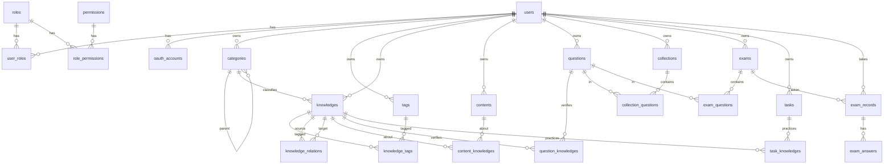

# 实体设计

对应 `apps/api` 领域模块。表名 `snake_case`，TypeScript 实体 PascalCase。主键一律 UUID。时间字段 `timestamptz`。用户自有数据带 `owner_id`；角色与权限是全局配置。

## 约定

| 项 | 规则 |
|----|------|
| 主键 | `id uuid`，应用侧生成 |
| 审计 | `created_at`、`updated_at`；关联表同样保留 `updated_at`（软删除会改这一列） |
| 删除 | 软删除：`deleted_at timestamptz`，空表示未删。默认查询过滤 `deleted_at IS NULL`。唯一约束做成部分索引（仅未删行） |
| 状态 | 启用/禁用用 `boolean`（`true` 启用，`false` 禁用），不用枚举字符串 |
| 进度 | 工作流用独立字段 `progress`（考试作答、任务），不占用 `status` |
| 归属 | 业务行用 `owner_id → users.id`；管理员可跨用户 |
| 权限码 | `resource:action`，如 `knowledge:create` |
| JSON | PostgreSQL `jsonb`，用于选项、答案、附件元数据 |

---

## 关系总览

---

## 1. Auth / RBAC

本节已按软删除 + 布尔状态定稿。查询默认带 `deleted_at IS NULL`。

`status` 与 `deleted_at` 分工：`status = false` 是停用（账号还在，不能登录）；`deleted_at` 有值是注销/解绑（对业务不可见，邮箱等唯一键释放）。

### users

| 字段 | 类型 | 约束 | 说明 |
|------|------|------|------|
| id | uuid | PK | |
| email | varchar(255) | not null | 登录名 |
| password_hash | varchar(255) | not null | 本地密码；仅 OAuth 时可存随机不可登录哈希 |
| display_name | varchar(100) | not null | |
| status | boolean | not null, default true | `true` 启用，`false` 禁用 |
| email_verified_at | timestamptz | nullable | 空表示未验证 |
| created_at | timestamptz | not null | |
| updated_at | timestamptz | not null | |
| deleted_at | timestamptz | nullable | 非空即软删除 |

部分唯一索引：`(email) WHERE deleted_at IS NULL`。

登录条件：`deleted_at IS NULL` 且 `status = true`。软删除用户不级联改业务数据，历史 `owner_id` 仍指向该行。

### oauth_accounts

同一用户可绑多个第三方账号。解绑为软删除。

| 字段 | 类型 | 约束 | 说明 |
|------|------|------|------|
| id | uuid | PK | |
| user_id | uuid | FK users, not null | |
| provider | varchar(50) | not null | 如 `github`、`google` |
| provider_user_id | varchar(255) | not null | 第三方侧用户 id |
| created_at | timestamptz | not null | |
| updated_at | timestamptz | not null | |
| deleted_at | timestamptz | nullable | 非空即已解绑 |

部分唯一索引：`(provider, provider_user_id) WHERE deleted_at IS NULL`。

### roles

| 字段 | 类型 | 约束 | 说明 |
|------|------|------|------|
| id | uuid | PK | |
| code | varchar(50) | not null | `admin` / `user` |
| name | varchar(100) | not null | |
| status | boolean | not null, default true | `true` 启用，`false` 禁用 |
| created_at | timestamptz | not null | |
| updated_at | timestamptz | not null | |
| deleted_at | timestamptz | nullable | |

部分唯一索引：`(code) WHERE deleted_at IS NULL`。

鉴权只加载 `status = true` 且未删除的角色。系统内置 `admin`、`user` 不允许软删除（应用层禁止）。

### permissions

| 字段 | 类型 | 约束 | 说明 |
|------|------|------|------|
| id | uuid | PK | |
| code | varchar(100) | not null | `knowledge:create` |
| name | varchar(100) | not null | |
| status | boolean | not null, default true | `true` 启用，`false` 禁用 |
| created_at | timestamptz | not null | |
| updated_at | timestamptz | not null | |
| deleted_at | timestamptz | nullable | |

部分唯一索引：`(code) WHERE deleted_at IS NULL`。

初始权限：`knowledge`、`content`、`question`、`exam`、`task` 各自 `read/create/update/delete`。内置权限不允许软删除。

### user_roles

中间表自带主键，便于软删除后再重新绑定。

| 字段 | 类型 | 约束 | 说明 |
|------|------|------|------|
| id | uuid | PK | |
| user_id | uuid | FK users, not null | |
| role_id | uuid | FK roles, not null | |
| created_at | timestamptz | not null | |
| updated_at | timestamptz | not null | |
| deleted_at | timestamptz | nullable | 非空即已解绑 |

部分唯一索引：`(user_id, role_id) WHERE deleted_at IS NULL`。

新注册用户默认绑定角色 `user`。

### role_permissions

| 字段 | 类型 | 约束 | 说明 |
|------|------|------|------|
| id | uuid | PK | |
| role_id | uuid | FK roles, not null | |
| permission_id | uuid | FK permissions, not null | |
| created_at | timestamptz | not null | |
| updated_at | timestamptz | not null | |
| deleted_at | timestamptz | nullable | 非空即已收回该权限 |

部分唯一索引：`(role_id, permission_id) WHERE deleted_at IS NULL`。

---

## 2. Knowledge

本节已按软删除 + 布尔状态对齐。`status` 表示启用/禁用；草稿用 `published`，不再用 `DRAFT` / `ACTIVE` / `ARCHIVED` 枚举。

### categories

树形分类，`parent_id` 自关联，不拆 SubCategory。

| 字段 | 类型 | 约束 | 说明 |
|------|------|------|------|
| id | uuid | PK | |
| owner_id | uuid | FK users, not null | |
| parent_id | uuid | FK categories, nullable | 根节点为空；不可指向已软删除节点 |
| name | varchar(100) | not null | |
| slug | varchar(120) | not null | |
| description | text | nullable | |
| sort | int | not null, default 0 | 同级排序，越小越前 |
| status | boolean | not null, default true | `true` 启用，`false` 禁用 |
| created_at | timestamptz | not null | |
| updated_at | timestamptz | not null | |
| deleted_at | timestamptz | nullable | |

部分唯一索引：`(owner_id, parent_id, slug) WHERE deleted_at IS NULL`。`parent_id` 为空时用 `COALESCE(parent_id, '00000000-0000-0000-0000-000000000000')` 或等价部分索引覆盖根节点。

应用层：禁止把节点设为自己的子孙；存在未删除子节点时禁止软删除；软删除后 `knowledges.category_id` 不改，展示时分类已删则视为未分类。

### tags

横向特征，如 Hook、性能、设计模式。

| 字段 | 类型 | 约束 | 说明 |
|------|------|------|------|
| id | uuid | PK | |
| owner_id | uuid | FK users, not null | |
| name | varchar(50) | not null | |
| status | boolean | not null, default true | `true` 启用，`false` 禁用 |
| created_at | timestamptz | not null | |
| updated_at | timestamptz | not null | |
| deleted_at | timestamptz | nullable | |

部分唯一索引：`(owner_id, name) WHERE deleted_at IS NULL`。

### knowledges

知识点本身。正文可空：允许先建节点，再靠 Content 承载材料。

| 字段 | 类型 | 约束 | 说明 |
|------|------|------|------|
| id | uuid | PK | |
| owner_id | uuid | FK users, not null | |
| category_id | uuid | FK categories, nullable | 可指向已软删除分类，展示时当未分类 |
| title | varchar(200) | not null | |
| summary | text | nullable | |
| body | text | nullable | 可选的要点正文 |
| published | boolean | not null, default false | `false` 草稿，`true` 已发布 |
| status | boolean | not null, default true | `true` 启用，`false` 禁用 |
| created_at | timestamptz | not null | |
| updated_at | timestamptz | not null | |
| deleted_at | timestamptz | nullable | |

默认列表：`deleted_at IS NULL AND status = true AND published = true`。

索引：`(owner_id, category_id)`、`(owner_id, status)`、`(owner_id, published)`（均配合查询侧过滤 `deleted_at`）。

### knowledge_tags

中间表自带主键，摘标签为软删除。

| 字段 | 类型 | 约束 | 说明 |
|------|------|------|------|
| id | uuid | PK | |
| knowledge_id | uuid | FK knowledges, not null | |
| tag_id | uuid | FK tags, not null | |
| created_at | timestamptz | not null | |
| updated_at | timestamptz | not null | |
| deleted_at | timestamptz | nullable | |

部分唯一索引：`(knowledge_id, tag_id) WHERE deleted_at IS NULL`。

### knowledge_relations

有向关系。同一对节点同一类型在未删除行中只允许一条。

| 字段 | 类型 | 约束 | 说明 |
|------|------|------|------|
| id | uuid | PK | |
| owner_id | uuid | FK users, not null | 冗余，便于按用户查询 |
| source_id | uuid | FK knowledges, not null | |
| target_id | uuid | FK knowledges, not null | |
| relation_type | varchar(30) | not null | 见下表 |
| created_at | timestamptz | not null | |
| updated_at | timestamptz | not null | |
| deleted_at | timestamptz | nullable | |

部分唯一索引：`(source_id, target_id, relation_type) WHERE deleted_at IS NULL`。检查：`source_id <> target_id`。两端知识点已软删除时，关系仍保留行，默认查询不可见。

| relation_type | 含义 |
|---------------|------|
| RELATED | 相关 |
| PREREQUISITE | source 的前置是 target |
| DERIVED | source 由 target 派生 |
| EXTENDS | source 扩展 target |
| CONTRASTS | 对比 |

---

## 3. Content

本节已按软删除 + 布尔状态对齐。`type` 仍是载体形态，不是启用状态。

### contents

知识载体。一张表 + `type` 区分形态，避免 Note / Article / Document / Resource 四套平行结构。

| 字段 | 类型 | 约束 | 说明 |
|------|------|------|------|
| id | uuid | PK | |
| owner_id | uuid | FK users, not null | |
| type | varchar(20) | not null | `NOTE` / `ARTICLE` / `DOCUMENT` / `RESOURCE` |
| title | varchar(200) | not null | |
| body | text | nullable | NOTE / ARTICLE 正文 |
| summary | text | nullable | 主要用于 ARTICLE |
| url | varchar(2000) | nullable | RESOURCE 外链 |
| file_key | varchar(500) | nullable | DOCUMENT 对象存储 key |
| mime_type | varchar(100) | nullable | DOCUMENT |
| file_size | bigint | nullable | 字节 |
| metadata | jsonb | nullable | 额外信息 |
| published | boolean | not null, default false | `false` 草稿，`true` 已发布 |
| status | boolean | not null, default true | `true` 启用，`false` 禁用 |
| created_at | timestamptz | not null | |
| updated_at | timestamptz | not null | |
| deleted_at | timestamptz | nullable | |

默认列表：`deleted_at IS NULL AND status = true AND published = true`。

按 type 约束（应用层 + DB CHECK）：

- `NOTE`：`body` 必填
- `ARTICLE`：`body` 必填
- `DOCUMENT`：`file_key` 必填
- `RESOURCE`：`url` 必填

软删除 DOCUMENT 不删对象存储文件，由后续清理任务处理 `deleted_at` 已久的 `file_key`。

### content_knowledges

一条内容可挂多个知识点。解绑为软删除。

| 字段 | 类型 | 约束 | 说明 |
|------|------|------|------|
| id | uuid | PK | |
| content_id | uuid | FK contents, not null | |
| knowledge_id | uuid | FK knowledges, not null | |
| created_at | timestamptz | not null | |
| updated_at | timestamptz | not null | |
| deleted_at | timestamptz | nullable | |

部分唯一索引：`(content_id, knowledge_id) WHERE deleted_at IS NULL`。

内容或知识点软删除后，关联行保留，默认查询不可见。挂接时两端必须同一 `owner_id` 且均未删除。

---

## 4. Question

本节已按软删除 + 布尔状态对齐。题目 `type` 仍是题型，不是启用状态。软删除题目不阻止历史试卷引用；作答应看 Exam 的题面快照。

### questions

| 字段 | 类型 | 约束 | 说明 |
|------|------|------|------|
| id | uuid | PK | |
| owner_id | uuid | FK users, not null | |
| type | varchar(30) | not null | 见下表 |
| stem | text | not null | 题干 |
| options | jsonb | nullable | 选择题选项数组 `[{id, text}]` |
| answer | jsonb | not null | 标准答案，结构随 type |
| explanation | text | nullable | 解析 |
| difficulty | int | not null, default 3 | 1–5 |
| published | boolean | not null, default false | `false` 草稿，`true` 已发布 |
| status | boolean | not null, default true | `true` 启用，`false` 禁用 |
| created_at | timestamptz | not null | |
| updated_at | timestamptz | not null | |
| deleted_at | timestamptz | nullable | |

默认题库列表：`deleted_at IS NULL AND status = true AND published = true`。组卷、加入题集时只允许未删除且启用且已发布的题。

| type | options | answer |
|------|---------|--------|
| SINGLE_CHOICE | 必填 | `{ "optionId": "..." }` |
| MULTIPLE_CHOICE | 必填 | `{ "optionIds": ["..."] }` |
| TRUE_FALSE | 空 | `{ "value": true }` |
| SHORT_ANSWER | 空 | `{ "text": "..." }` |
| FILL_BLANK | 空 | `{ "blanks": ["..."] }` |

### question_knowledges

题目用来验证哪些知识点。解绑为软删除。

| 字段 | 类型 | 约束 | 说明 |
|------|------|------|------|
| id | uuid | PK | |
| question_id | uuid | FK questions, not null | |
| knowledge_id | uuid | FK knowledges, not null | |
| created_at | timestamptz | not null | |
| updated_at | timestamptz | not null | |
| deleted_at | timestamptz | nullable | |

部分唯一索引：`(question_id, knowledge_id) WHERE deleted_at IS NULL`。挂接时两端必须同一 `owner_id` 且均未删除。

### collections

题集。

| 字段 | 类型 | 约束 | 说明 |
|------|------|------|------|
| id | uuid | PK | |
| owner_id | uuid | FK users, not null | |
| name | varchar(200) | not null | |
| description | text | nullable | |
| published | boolean | not null, default false | `false` 草稿，`true` 已发布 |
| status | boolean | not null, default true | `true` 启用，`false` 禁用 |
| created_at | timestamptz | not null | |
| updated_at | timestamptz | not null | |
| deleted_at | timestamptz | nullable | |

默认列表：`deleted_at IS NULL AND status = true AND published = true`。

### collection_questions

从题集移除题目为软删除。

| 字段 | 类型 | 约束 | 说明 |
|------|------|------|------|
| id | uuid | PK | |
| collection_id | uuid | FK collections, not null | |
| question_id | uuid | FK questions, not null | |
| sort | int | not null, default 0 | |
| created_at | timestamptz | not null | |
| updated_at | timestamptz | not null | |
| deleted_at | timestamptz | nullable | |

部分唯一索引：`(collection_id, question_id) WHERE deleted_at IS NULL`。

题目或题集软删除后，关联行保留，默认查询不可见。

---

## 5. Exam

本节已按软删除 + 布尔状态对齐。组卷引用当前题目；作答写入题面快照，事后改题或软删题不影响历史成绩。

试卷的启用/发布用 `status` / `published`。作答进度不叫 `status`，用 `progress`，避免和布尔启用冲突。

### exams

| 字段 | 类型 | 约束 | 说明 |
|------|------|------|------|
| id | uuid | PK | |
| owner_id | uuid | FK users, not null | |
| title | varchar(200) | not null | |
| description | text | nullable | |
| duration_seconds | int | nullable | 空表示不限时 |
| published | boolean | not null, default false | `false` 草稿，`true` 已发布 |
| status | boolean | not null, default true | `true` 启用，`false` 禁用 |
| created_at | timestamptz | not null | |
| updated_at | timestamptz | not null | |
| deleted_at | timestamptz | nullable | |

默认可考列表：`deleted_at IS NULL AND status = true AND published = true`。软删除试卷不删作答记录。

### exam_questions

从试卷移除题目为软删除。已有作答记录时仍可下架题目，历史答案靠快照。

| 字段 | 类型 | 约束 | 说明 |
|------|------|------|------|
| id | uuid | PK | |
| exam_id | uuid | FK exams, not null | |
| question_id | uuid | FK questions, not null | |
| sort | int | not null, default 0 | |
| score | numeric(8,2) | not null, default 1 | 本题分值 |
| created_at | timestamptz | not null | |
| updated_at | timestamptz | not null | |
| deleted_at | timestamptz | nullable | |

部分唯一索引：`(exam_id, question_id) WHERE deleted_at IS NULL`。组卷时题目须未删除、已启用、已发布。

### exam_records

一次作答。

| 字段 | 类型 | 约束 | 说明 |
|------|------|------|------|
| id | uuid | PK | |
| exam_id | uuid | FK exams, not null | |
| user_id | uuid | FK users, not null | 作答人 |
| progress | varchar(20) | not null | `IN_PROGRESS` / `SUBMITTED` / `TIMEOUT` |
| status | boolean | not null, default true | `true` 计入成绩，`false` 作废（重考前作废旧卷） |
| started_at | timestamptz | not null | |
| submitted_at | timestamptz | nullable | |
| total_score | numeric(8,2) | nullable | 交卷后写入 |
| earned_score | numeric(8,2) | nullable | 交卷后写入 |
| created_at | timestamptz | not null | |
| updated_at | timestamptz | not null | |
| deleted_at | timestamptz | nullable | |

部分唯一索引：`(exam_id, user_id) WHERE deleted_at IS NULL AND progress = 'IN_PROGRESS'`，同一人同一试卷同时只能有一份进行中的作答。

### exam_answers

| 字段 | 类型 | 约束 | 说明 |
|------|------|------|------|
| id | uuid | PK | |
| record_id | uuid | FK exam_records, not null | |
| question_id | uuid | FK questions, not null | 原题引用，题被软删后仍保留 |
| stem_snapshot | text | not null | 作答时题干 |
| options_snapshot | jsonb | nullable | 作答时选项 |
| answer_snapshot | jsonb | not null | 作答时标准答案 |
| submitted_answer | jsonb | nullable | 用户作答 |
| is_correct | boolean | nullable | 交卷后判定 |
| score | numeric(8,2) | nullable | 本题得分 |
| created_at | timestamptz | not null | |
| updated_at | timestamptz | not null | |
| deleted_at | timestamptz | nullable | 清答案/重答该题时软删旧行 |

部分唯一索引：`(record_id, question_id) WHERE deleted_at IS NULL`。

---

## 6. Task

本节已按软删除 + 布尔状态对齐。把知识变成可执行行动。进度不叫 `status`，用 `progress`。

### tasks

| 字段 | 类型 | 约束 | 说明 |
|------|------|------|------|
| id | uuid | PK | |
| owner_id | uuid | FK users, not null | |
| title | varchar(200) | not null | |
| description | text | nullable | |
| progress | varchar(20) | not null, default `TODO` | `TODO` / `DOING` / `DONE` |
| status | boolean | not null, default true | `true` 启用，`false` 取消/搁置（替代原 `CANCELLED`） |
| due_at | timestamptz | nullable | |
| completed_at | timestamptz | nullable | `progress = DONE` 时写入 |
| created_at | timestamptz | not null | |
| updated_at | timestamptz | not null | |
| deleted_at | timestamptz | nullable | |

默认列表：`deleted_at IS NULL AND status = true`。

索引：`(owner_id, progress)`、`(owner_id, status)`、`(owner_id, due_at)`。

`progress` 改为 `DONE` 时写入 `completed_at`；从完成改回未完成时清空 `completed_at`。

### task_knowledges

解绑知识点为软删除。

| 字段 | 类型 | 约束 | 说明 |
|------|------|------|------|
| id | uuid | PK | |
| task_id | uuid | FK tasks, not null | |
| knowledge_id | uuid | FK knowledges, not null | |
| created_at | timestamptz | not null | |
| updated_at | timestamptz | not null | |
| deleted_at | timestamptz | nullable | |

部分唯一索引：`(task_id, knowledge_id) WHERE deleted_at IS NULL`。挂接时两端必须同一 `owner_id` 且均未删除。

---

## 外键与级联

所有领域都不在数据库层做 `ON DELETE CASCADE`：删除只写 `deleted_at`。

| 子表 | 父表 | 删除策略 |
|------|------|----------|
| oauth_accounts / user_roles / 各 owner 业务表 | users | 软删除用户，外键行保留 |
| knowledges.category_id | categories | 软删除分类，外键保留；展示视为未分类 |
| categories.parent_id | categories | 有未删除子节点时禁止软删除父节点 |
| knowledge_tags / knowledge_relations | knowledges | 软删除知识点，关系行保留，默认查询过滤 |
| content_knowledges | contents / knowledges | 软删除任一侧，关联行保留，默认查询过滤 |
| question_knowledges / collection_questions | questions / collections / knowledges | 软删除任一侧，关联行保留；历史试卷仍可引用已删题 |
| exam_questions | exams / questions | 软删除任一侧，组卷关联保留；作答靠快照 |
| exam_records | exams / users | 软删除试卷或用户，作答行保留 |
| exam_answers | exam_records | 软删除作答记录，答案行保留 |
| task_knowledges | tasks / knowledges | 软删除任一侧，关联行保留，默认查询过滤 |

跨表引用必须同一 `owner_id`（知识点、内容、题目、任务互相挂接时），在应用层校验。
